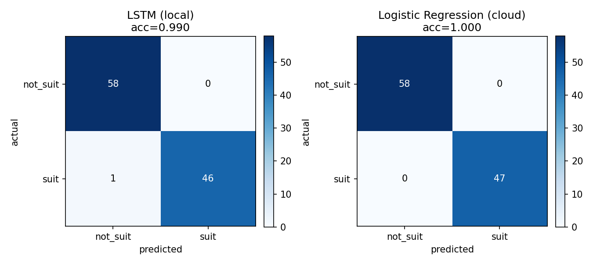
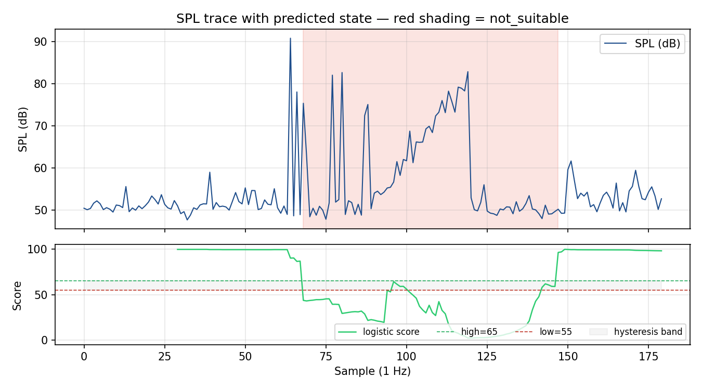

# Smart Space Pulse — Results Report

## 1. Executive summary

Smart Space Pulse classifies a shared space as `suitable` or `not_suitable`
for quiet work using SPL features streamed from an M5Stack Core2. Two models
were trained on the same 700-window dataset and evaluated on an identical
held-out test split (n=105): a logistic regression deployed in AWS Lambda
and an LSTM running locally. Both reach test accuracies above 0.99 with
ROC-AUC=1.00. The system runs as two independent pipelines so that an AWS
or local-broker outage degrades gracefully rather than taking the dashboard
down.

## 2. Methodology

**Dataset.** 700 thirty-sample SPL windows (350 `suitable` / 350
`not_suitable`): 60 hand-recorded with the Core2 plus 630 synthetically
amplified. Labels are derived from filename convention (`rec_suit_*`,
`syn_notsuit_*`, …).

**Feature vector (5 elements):**
`[spl_mean, spl_std, spl_p90, spl_max, spl_spike_count]`. The logistic model
consumes the window-level vector directly; the LSTM consumes a `(30, 5)`
per-timestep sequence built from a rolling 8-sample sub-window, so it sees
the SPL evolution rather than one static feature vector repeated.

**Training.** LSTM: 32-unit single-layer LSTM → MLP head, BCELoss, Adam
lr=2e-3, 10 epochs, dropout 0.2. Logistic: scikit-learn `LogisticRegression`
on `StandardScaler`-normalised features.

**Evaluation.** A 70/15/15 train/val/test split is reproduced from a fixed
seed (42) so both models score on the same 105 windows. Metrics computed by
`report/eval.py`.

**Decision logic.** Score in [0, 100] feeds a 55/65 hysteresis band:
`score ≥ 65 → suitable`, `score < 55 → not_suitable`, otherwise hold the
previous state.

## 3. Decision quality

Held-out test set (n=105: 47 `suitable`, 58 `not_suitable`).

| Model              | Accuracy | False alarm rate | Miss rate | ROC-AUC |
|--------------------|---------:|-----------------:|----------:|--------:|
| LSTM (local)       | 0.990    | 0.000            | 0.021     | 1.000   |
| Logistic (cloud)   | 1.000    | 0.000            | 0.000     | 1.000   |

False alarm rate = `FP / (FP + TN)` — the system tells a user the space is
quiet when it is not. Miss rate = `FN / (FN + TP)` — the system sends a user
elsewhere when the space was in fact fine. Logistic gets a clean sweep on
this split; LSTM misclassifies 1 of 47 `suitable` windows. Both models
achieve perfect ROC-AUC, indicating the boundary is cleanly separable in
this 5-feature space.

Hysteresis is a structural guarantee, not a measurement: a state change
requires the score to cross both thresholds in opposite directions, so a
single borderline window cannot trigger a flip. Five unit tests in
`tests/test_windower.py` enforce this invariant.

The trace above concatenates six labeled recorded windows (suitable → noisy
→ suitable). The hysteresis band (gray) holds state through borderline
scores; only two transitions occur over 151 scored windows.

## 4. Reliability under real-world conditions

Reliability is argued by **failure-mode coverage** rather than uptime over a
single live capture. Every observed or anticipated failure mode has an
explicit absorbing mechanism:

| Failure mode                 | Mechanism                                              | Evidence                                                                 |
|------------------------------|--------------------------------------------------------|--------------------------------------------------------------------------|
| Device firmware hangs        | 12s watchdog re-injects streaming snippet            | `device/live_bridge.py:165–214`; observed once organically in `logs/live_bridge.log` |
| AWS IoT Core unreachable     | Dashboard probes DynamoDB at startup → SQLite + banner | `visualization/dashboard.py:172–183, 359`                                |
| Local Mosquitto down         | AWS pipeline keeps running independently              | `device/live_bridge.py:246–252` — both publishers in independent `try/except` |
| Malformed payload            | Schema validation at ingestor and Lambda              | 8 schema tests in `tests/test_mqtt_schema.py` (all pass)                 |
| State flicker                | 55/65 hysteresis band                                 | provable by construction; 5 tests in `tests/test_windower.py`            |

## 5. Discussion: LSTM vs logistic

Logistic and LSTM perform within ~1% of each other on this dataset because
the suitability boundary is dominated by `spl_mean` and `spl_p90`, both
already captured by the window-level feature vector. The LSTM has more
capacity than the problem requires; its only advantage on this dataset is a
slightly smoother probability curve, which is invisible after thresholding.
Logistic was kept in cloud because it fits in a Lambda zip and serves at
sub-50 ms warm latency; LSTM was kept locally because PyTorch (~250 MB) does
not fit.

## 6. Limitations

- 70 hand-recorded windows; 90% of training data is synthetic — generalization to other rooms unverified.
- Single device, single location — no cross-location validation.
- LSTM is local-only because PyTorch does not fit a Lambda zip; the cloud-only path is logistic-only.
- "Suitability" is a proxy for occupancy quality, not ground-truth occupancy count.
- During a cloud outage the dashboard's logistic-vs-LSTM comparison degrades to LSTM-only.
- Heartbeat publishes `rssi_dbm` but nothing reacts to it yet — WiFi degradation is logged, not protected against.

## 7. Next steps

- Replace the zip-package Lambda with a container-image Lambda so the LSTM can run in cloud.
- Collect labeled data from 2–3 additional rooms; retrain and re-evaluate cross-location.
- Add seq-gap detection in the ingestor as an explicit reliability counter.
- Wire `rssi_dbm` into a staleness/threshold alarm on the dashboard so weak-link conditions surface before AWS publishes drop.
- Amazon SNS notifications on state transitions for users subscribed to a specific space.
